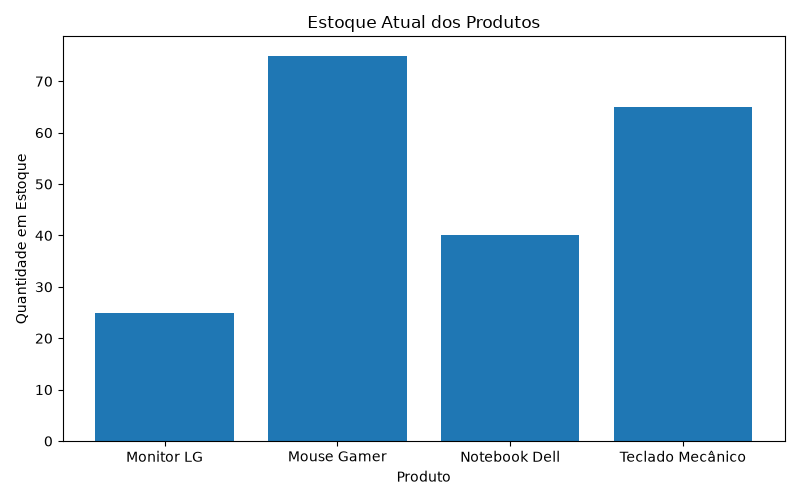

# Projeto 1 - Controle de estoque e movimentação de produtos


## 📋 Sobre o Projeto

Este projeto foi desenvolvido com o objetivo de demonstrar habilidades em:

* SQL
* Python
* ETL (Extração, Transformação e Carga de Dados)
* Banco de Dados SQLite
* Análise de Dados
* Automação de Processos
* Git e GitHub

O sistema realiza a importação de produtos a partir de um arquivo CSV, armazena os dados em um banco SQLite, registra movimentações de entrada e saída de estoque, calcula automaticamente o estoque atual e gera relatórios com gráficos.

---

## 🚀 Funcionalidades

### Cadastro de Produtos

* Importação de produtos por arquivo CSV
* Armazenamento em banco SQLite

### Movimentação de Estoque

* Registro de entradas
* Registro de saídas
* Histórico de movimentações

### Controle de Estoque

* Cálculo automático do estoque atual
* Consulta consolidada por produto

### Relatórios

* Relatório em tabela utilizando Pandas
* Geração de gráfico de estoque atual
* Exportação visual para acompanhamento dos produtos

---

## 🛠 Tecnologias Utilizadas

* Python 3
* SQLite
* Pandas
* Matplotlib
* CSV
* Git
* GitHub

---

## 📂 Estrutura do Projeto

```text
controle-estoque/
│
├── banco/
│   └── estoque.db
│
├── dados/
│   └── produtos.csv
│
├── graficos/
│   └── estoque_atual.png
│
├── sql/
│   └── criar_tabelas.sql
│
├── src/
│   ├── criar_banco.py
│   ├── importar_excel.py
│   ├── movimentacoes.py
│   └── relatorios.py
│
├── requirements.txt
│
└── README.md
```

---

## 🗄 Modelagem do Banco de Dados

### Tabela Produtos

| Campo      | Tipo    |
| ---------- | ------- |
| id_produto | INTEGER |
| nome       | TEXT    |
| categoria  | TEXT    |
| preco      | REAL    |

### Tabela Movimentacoes

| Campo             | Tipo    |
| ----------------- | ------- |
| id_movimentacao   | INTEGER |
| id_produto        | INTEGER |
| tipo              | TEXT    |
| quantidade        | INTEGER |
| data_movimentacao | DATE    |

---

## 🔄 Fluxo do Projeto

```text
Arquivo CSV
      ↓
Importação com Pandas
      ↓
Banco SQLite
      ↓
Registro de Movimentações
      ↓
Consultas SQL
      ↓
Relatórios e Gráficos
```

---

## 📊 Exemplo de Consulta SQL

```sql
SELECT
    p.nome,
    SUM(
        CASE
            WHEN m.tipo = 'entrada'
            THEN m.quantidade
            ELSE -m.quantidade
        END
    ) AS estoque_atual
FROM Produtos p
JOIN Movimentacoes m
ON p.id_produto = m.id_produto
GROUP BY p.nome;
```

---

## ▶️ Como Executar o Projeto

### Clonar o repositório

```bash
git clone URL_DO_REPOSITORIO
```

### Instalar dependências

```bash
pip install -r requirements.txt
```

### Criar banco de dados

```bash
python src/criar_banco.py
```

### Importar produtos

```bash
python src/importar_excel.py
```

### Registrar movimentações

```bash
python src/movimentacoes.py
```

### Gerar relatório e gráfico

```bash
python src/relatorios.py
```

---

## 📈 Habilidades Demonstradas

✅ Modelagem de Banco de Dados

✅ SQL e Consultas Avançadas

✅ Relacionamentos entre Tabelas

✅ ETL com Python

✅ Manipulação de Dados com Pandas

✅ Automação de Processos

✅ Geração de Relatórios

✅ Visualização de Dados

✅ Controle de Estoque

✅ Versionamento com Git e GitHub

---

## 👨‍💻 Autor

Desenvolvido como projeto de portfólio para prática de SQL, Python, Banco de Dados e Análise de Dados.
